## Part 1. Установка ОC
- Установка **Ubuntu 20.04 Server LTS** без графического интерфейса. Скриншот с выводом команды - `cat /etc/issue`

    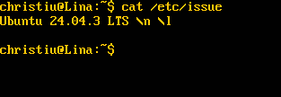

## Part 2. Создание пользователя

- Вызов команды для создания пользователя - `sudo adduser username`

    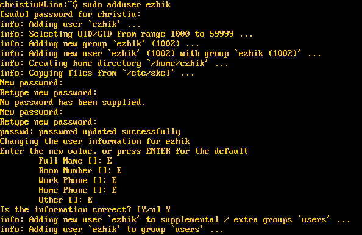

- Вызов команды для добавления в группу adm -  `sudo usermod -aG adm username`

    

- Вывод команды `cat /etc/passwd`

    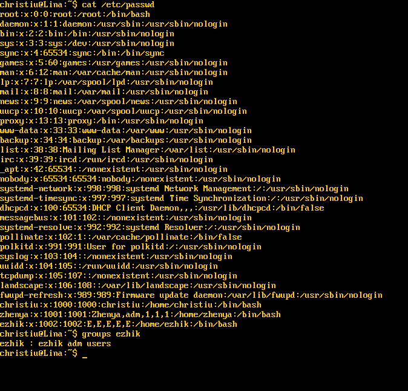

## Part 3. Настройка сети ОС

- Изменение название машины вида user-1 – `sudo hostnamectl set-hostname`
  
    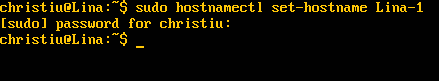

- Проверка нового имени – `hostnamectl`

    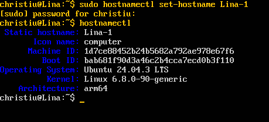

- Установка временной зоны, соответствующей текущему местоположению – `sudo timedatectl set-timezone Europe/Moscow`

    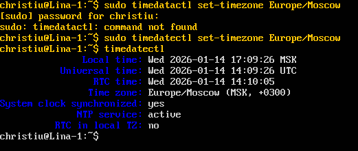

- Вывод названий сетевых интерфейсов с помощью консольной команды – `ip addr show` или его укороченная версия `ip a`

    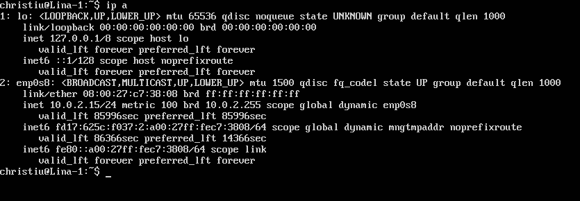

- Объяснение наличию интерфейса lo: для каждого действия в сети машине нужен ip (потому что она будет отправлять запрос, а обратно не будет приходить ничего). Благодаря lo машина может общается сама с собой – отправлять запрос и получать пакеты обратно (можно использовать для локального тестирования). Не связан с физическим оборудованием, имеет стандартный ip адрес, Используется для запуска и тестирования серверных приложений (веб-сервер, база данных) на той же машине, где они работают.

- Получение ip адреса устройства на котором ведется работа: данная задача уже описана текстом и скриншотом выше. ip 10.0.2.15/24

- Расшифровка DHCP: Dynamic Host Configuration Protocol (протокол динамической настройки узла) служит для назначения IP-адреса клиенту, протокол, который автоматически выдает ip-адрес. сетевой протокол позволяющий автоматически получать ip-адрес и другие параметры, необходимые для работы в сети TCP/IP (сетевая модель передачи данных, представленных в цифровом виде. Модель описывает способ передачи данных от источника информации к получателю.). Данный протокол работает по модели "клиент-сервер". Для автоматической конфигурации компьютер-клиент на этапе конфигурации сетевого устройства обращается к так называемому _серверу DHCP_ и получает от него нужные параметры.

- Чтобы узнать **внутренний IP шлюза (Default Gateway)** в Ubuntu используем `ip route show` или `netstat -r`

    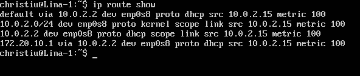

  Чтобы узнать **внешний IP шлюза** (мой публичный IP-адрес, который "видит" интернет) используем команду  `curl ifconfig.me`

    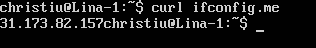

- Задаем статичные (заданные вручную, а не полученные от DHCP-сервера) настройки ip, gw, dns (используя публичный DNS-сервер, например 1.1.1.1 или 8.8.8.8) с помощью команды:
  **Узнаем имя интерфейса:** `ip link` (например, `enp0s3`).
  **Находим файл Netplan:** `ls /etc/netplan/` (обычно `50-cloud-init.yaml` или `01-network-manager-all.yaml`)
  **Редактируем файл** (например, `sudo nano /etc/netplan/01-network-manager-all.yaml`)
  **Добавляем секцию для своего интерфейса, отключив DHCP и указав IP:** 

    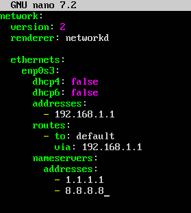

- После перезагрузки виртуальной машины статичные сетевые настройки (ip, gw, dns) соответствуют заданным в предыдущем пункте.

- Пингуем удаленный хост 1.1.1.1 ` sudo ping -c 5 1.1.1.1` 

    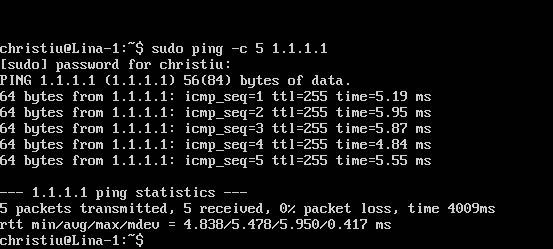

- Пингуем удаленный хост ya.ru `sudo ping -c 5 ya.ru` 

    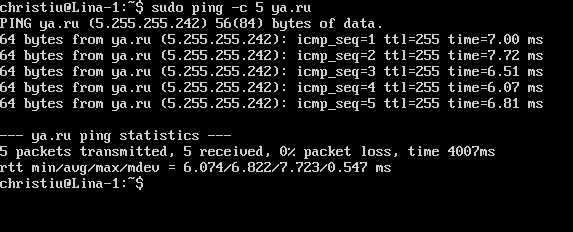
  
    Ключ `-c 5` отправит 5 пакетов и завершит команду, после чего появится статистика со строкой вида `0% packet loss`, если потерь нет.

## Part 4. Обновление ОС

- Обновление системных пакетов до последней версии на момент выполнения проекта - `sudo apt upgrade` 

    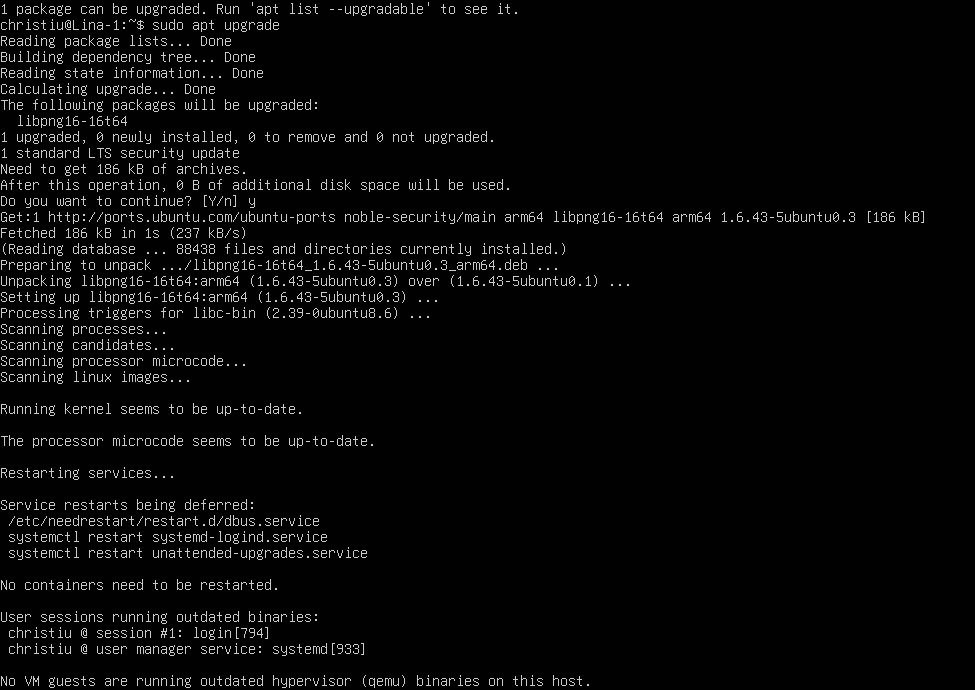

- Проверка на наличие обновлений той же командой 

    

## Part 5. Использование команды **sudo**

- Для выдачи разрешения пользователю, созданному в Part 2 sudo необходимо добавить пользователя в группу sudo командой `sudo usermod -aG sudo username`
SUDO - Super User Do, позволяет выдавать системные права администратора для выполнеия различных операций (чтобы выполнять системные задачи, такие как установка ПО, изменение системных файлов или управление службами, без необходимости постоянного входа под учётной записью `root`, что повышает безопасность и позволяет вести аудит команд.). Это безопасность, контроль доступа, подотчетность (все команды записываются в системный журнал), временное повышение прав (нужно вводить пароль после команды + работает без пароля определенное ограниченное время).
- Для изменение hostname  от имени пользователя созданного в Part 2 используем команду – `sudo hostnamectl set-hostname my-new-hostname`
- Для уточнения имени хоста используем `hostname` 

    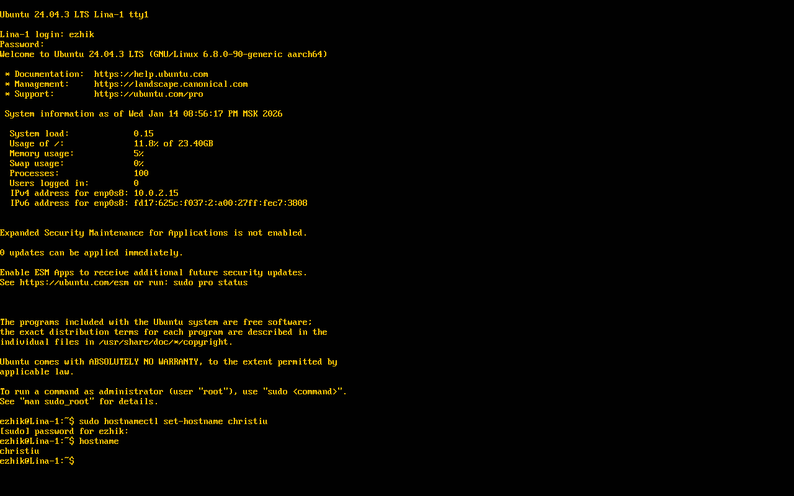

## Part 6. Установка и настройка службы времени

- Проверка включенной службы синхронизации времени командой `timedatectl show` 

    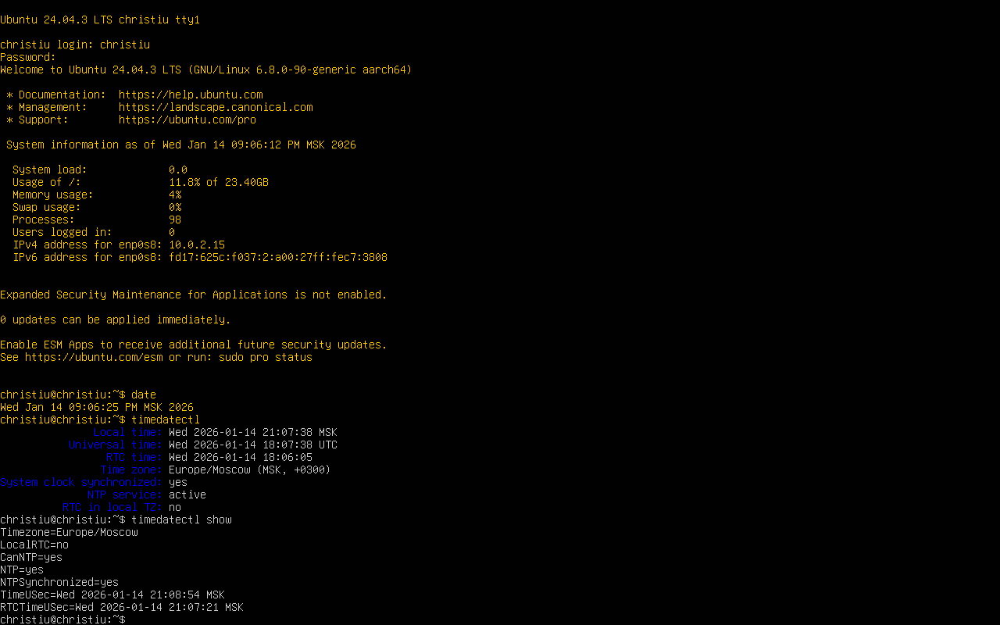

- Вывод времени часового пояса в котором я сейчас наожусь на скриншоте выше.
- Вывод следующей команды содержит NTPSynchronized=yes:
timedatectl show на сришкоте выше.
- скриншот с корректным выводом времени выше.

## Part 7. Установка и использование текстовых редакторов

- Устанавливаем редакторы VIM & NANO & MCEDIT командой `sudo apt install vim nano mc` 
- Создаем файл в NANO командой `nano test_nano.txt` Чтобы открыть файл используем ту же команду. 

    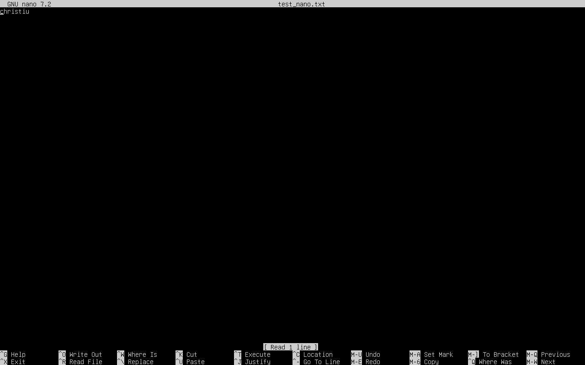

  Для выхода из nano c сохранением изменений нажимаем `^X` + Yes.

- Создаем файл в VIM командой  `vim test_vim.txt` Чтобы открыть файл используем ту же команду. Для перехода в режим ввода нажимаем `i` 

   

  Используем `:wq` (write and quit) и `Enter` для сохранения файла и выхода из Vim.

- Создаем файл в MCEDIT командой `touch test_mcedit.txt`, после чего открываем его командой `mcedit test_mcedit.txt`. Двойной эсейп для выхода. 

    

  Сохранить изменения  `fn+F2`.

- Редактируем NANO без сохранения 

    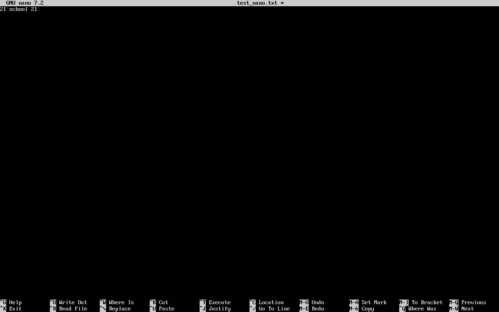

  Для выхода из nano без сохранения изменений нажимаем `^X` + `No`

- Редактируем VIM без сохранения 

    

  Используем Esc для выхода из insert, после `:q!` и `Enter`, чтобы выйти без сохранения.

- Редактируем MCEDIT без сохранения

    

  Сохранить без изменений `esc+esc+no`

- Переименовал содержимое всех файлов. Было `christiu` стало `21 school 21` 

- Для поиска по содержимому файла используем команду `Ctrl + W` для перехода к следующему совпадению  нажимаем `Enter`, а для поиска в обратном направлении используем `Ctrl + Q`; для поиска и замены есть комбинация `Ctrl +` 

    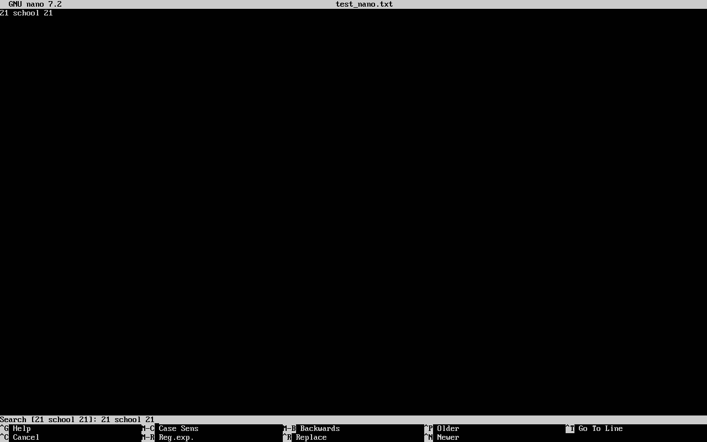

    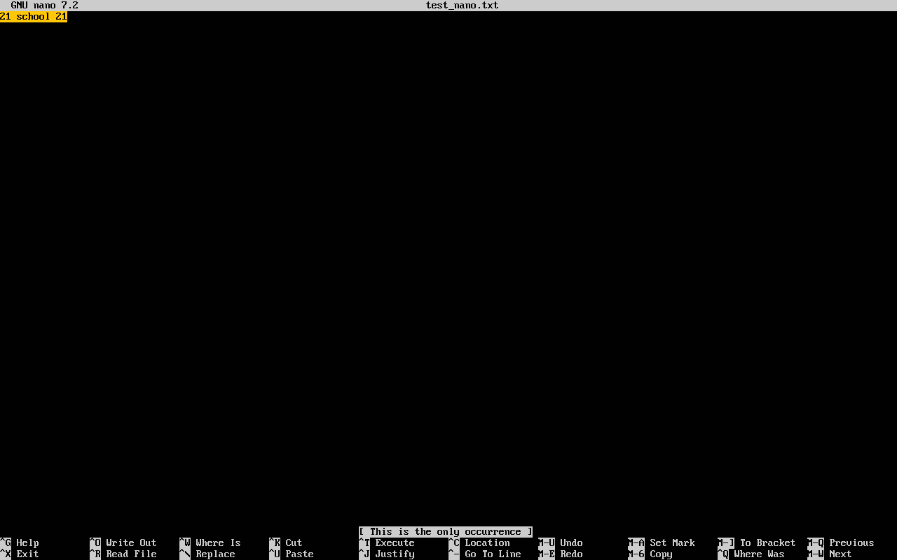

- Для поиска **вперед** (сверху вниз): вводим `/` и затем искомый текст (например, `/error`). Для поиска **назад** (снизу вверх): вводим `?` и затем искомый текст (например, `?error`). 
  `n` (next): перейти к следующему совпадению.
  `N` (Next): перейти к предыдущему совпадению. 

    

- в mcedit нужно нажать `fn+F7`, ввести искомую строку и нажать 1. `Enter`, чтобы найти первое вхождение. Нажимаем `F3`, чтобы найти следу ющие вхождения.

    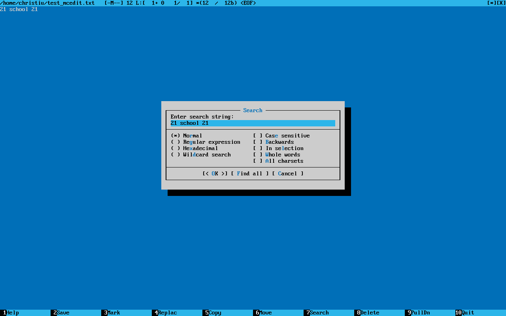 

- Для замены данных в nano используем команду `Ctrl + \\` . Внизу появится запрос `Replace:` (Заменить:). 
   **Вводим текст, который нужно найти**, и нажимаем `Enter`.
   **Вводим текст, на который нужно заменить**, и нажмите `Enter`.
   **Начнется поиск**: Nano перейдет к первому совпадению и спросит, хотите ли вы его заменить.
   Нажимаем`Y` (Yes), чтобы заменить текущее вхождение.
   Нажимаем `N` (No), чтобы пропустить.
   Нажимаем `A` (All), чтобы заменить **все** оставшиеся вхождения без запроса.
   Нажимаем `Ctrl + C` (или `Esc`, `Esc`), чтобы отменить операцию. 
   
   На скриншотах ниже поиск и замена значений строки в nano

    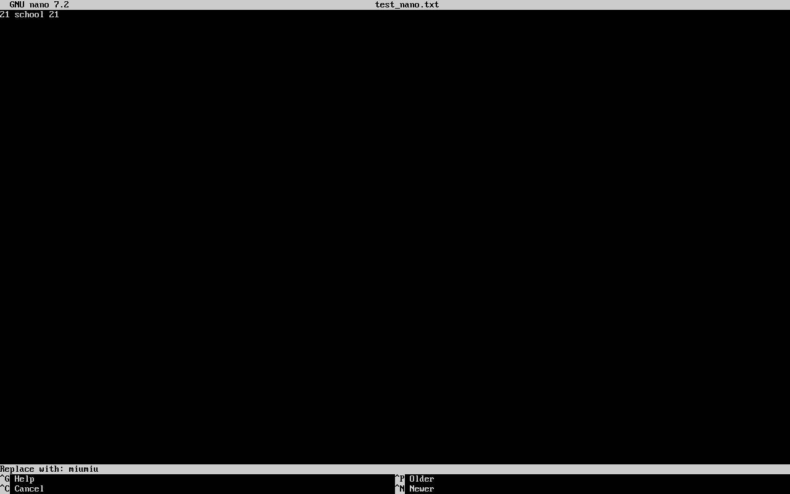

    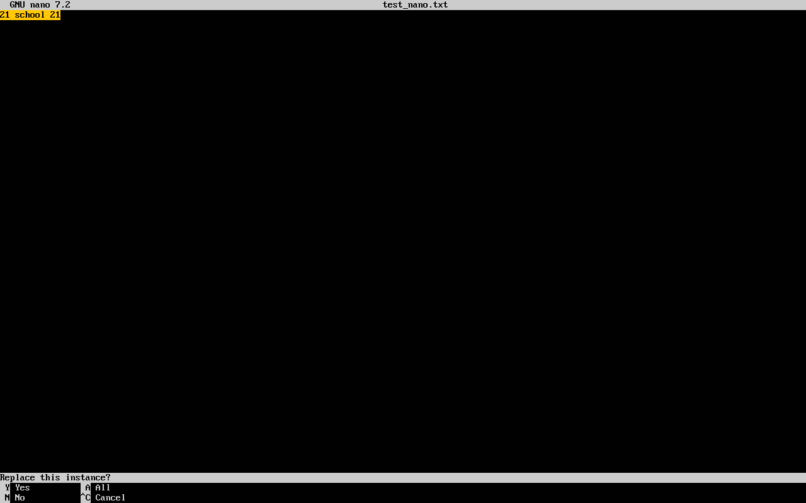
    
    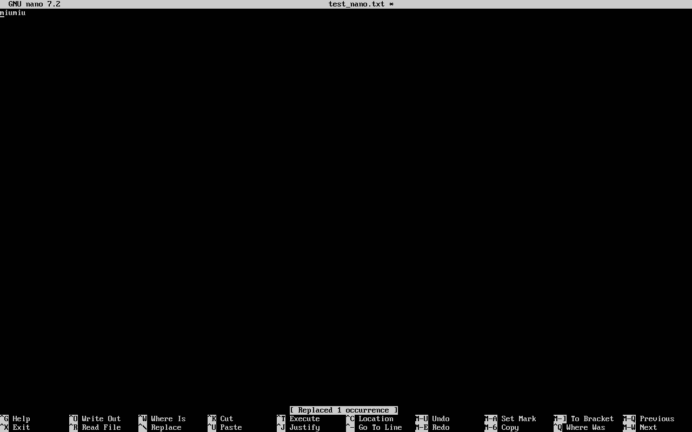

- Основная команда для замены во всем файле VIM
  
  **`: %s/искомое_слово/новое_слово/g`**
  `:s` — команда замены (substitute).
  `%` — указывает на весь файл.
  `g` — заменять все вхождения в строке, а не только первое.
  
  На скриншотах ниже поиск и замена значений строки в vim

    
    
    

- В mcedit мы используем сочетание клавиш `fn+F4`. Вводим искомую строку, нижу вводим строку для замены и нажимаем `ок`

    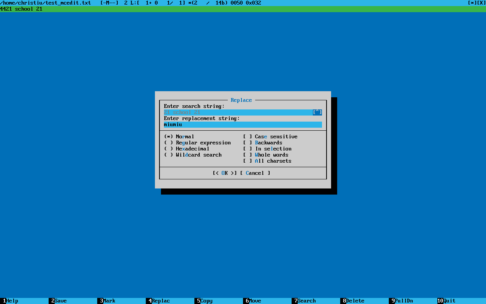
    
    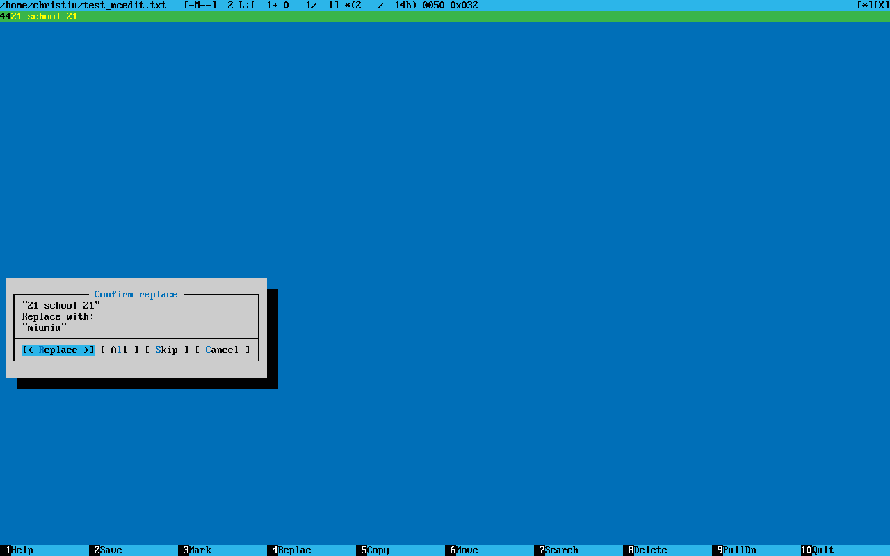

## Part 8. Установка и базовая настройка сервиса **SSHD**

- Устанавливаем сервер OpenSSH командой `sudo apt install openssh-server -y`
    
    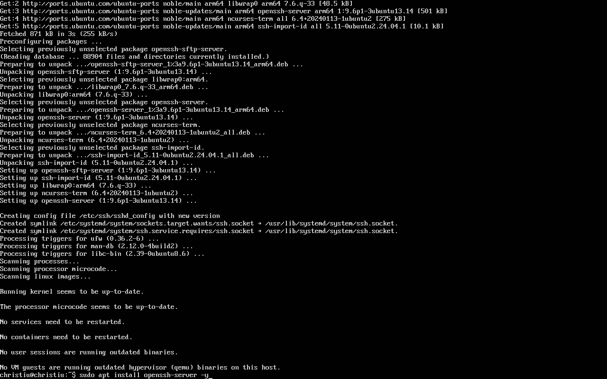

- Автостарт службы при запуске системы добавляется с помощью команды `sudo systemctl enable ssh`

    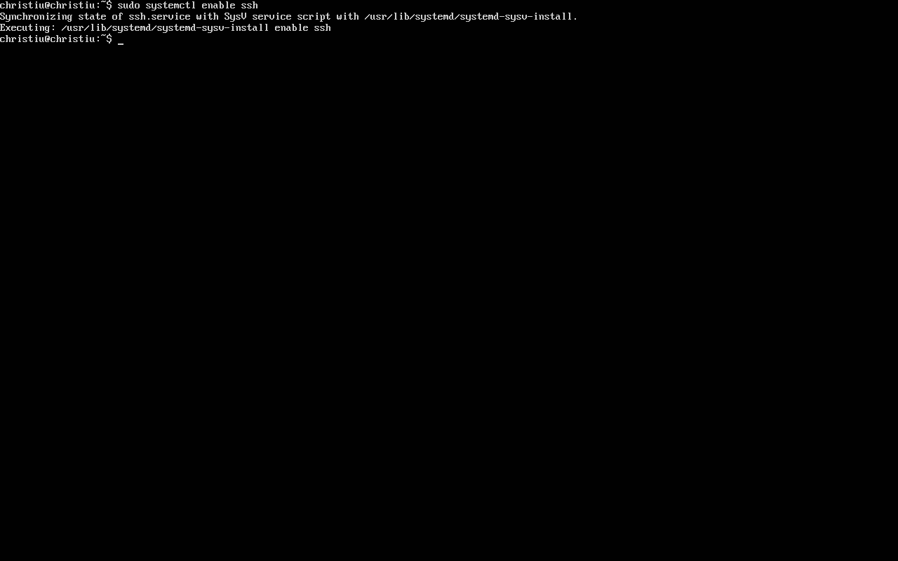

- Перенастроить службу на порт 2022 можно путем редактирования файла конфигураци `sudo nano /etc/ssh/sshd_config.` `#Port22` меняем на `Port 2022` 

    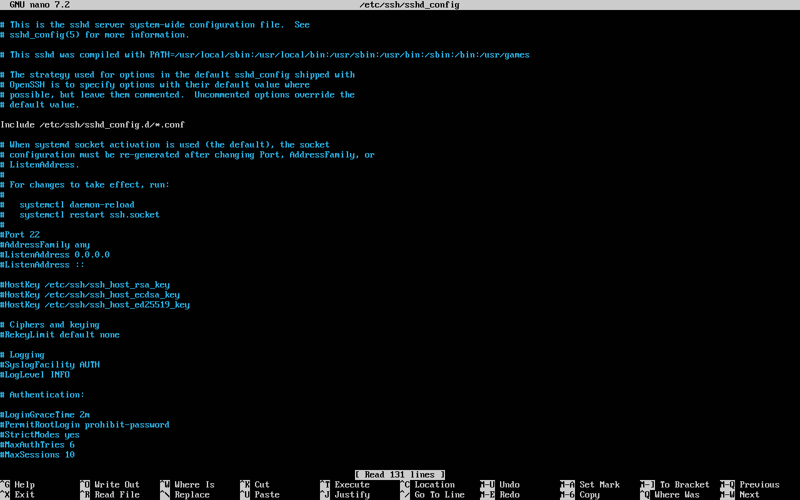
    
    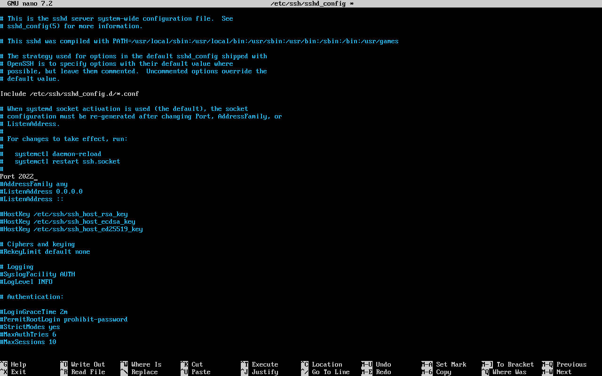

- Для проверки процесса sshd используем команду `ps aux | grep sshd`. та команда выводит детальный список всех процессов системы и фильтрует результаты, показывая только те, что связаны с sshd.
  
  Команда состоит из двух частей, соединённых пайпом (|): `ps aux` и `grep sshd`.**ps** — утилита для просмотра активных процессов.​
  
  **Ключи ps**

1.  **a** — показывает процессы всех пользователей, включая системные.​

2. **u** — добавляет пользовательский формат вывода (USER, %CPU, %MEM, START и др.).​

3. **x** — включает процессы без управляющего терминала (демоны вроде sshd).
   
   Вывод команды: 

    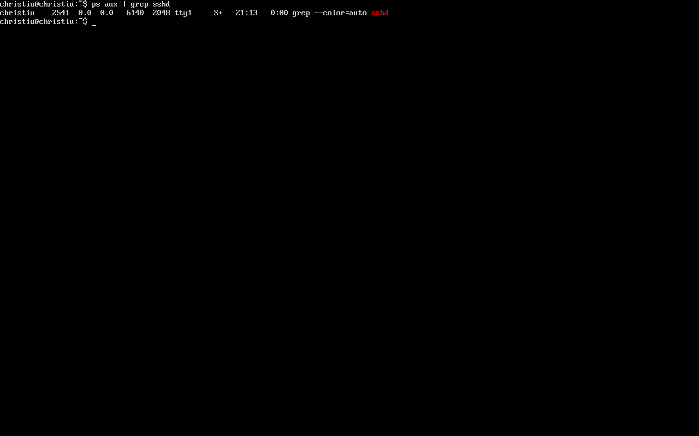
    
    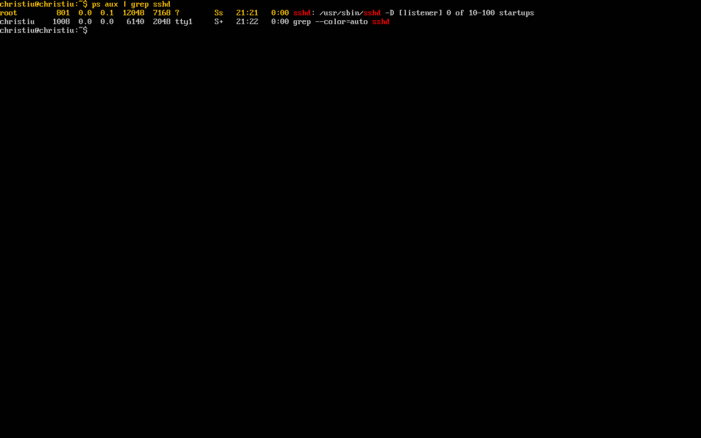
   
   - Перезагружаю систему командой `sudo reboot`.  
   - Устанавливаем команду `netstat` -  `sudo apt update && sudo apt install net-tools -y`. После установки проверяем версию: `netstat --version`. Пакет включает также ifconfig, route и arp.. Вывод команды `netstat -tan` 

    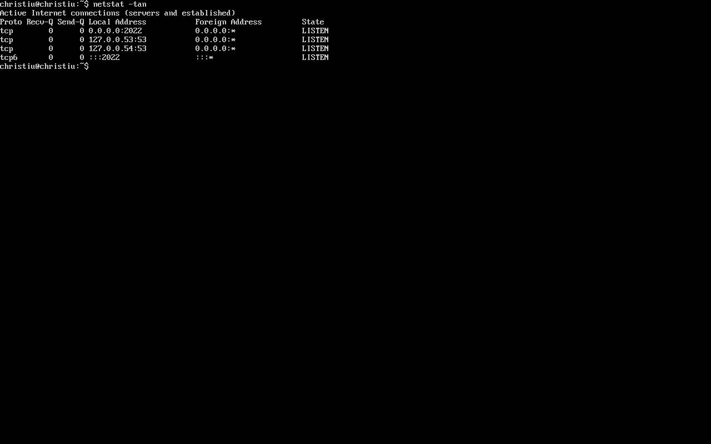

   - Объяснение ключа -tan - 
     **-t** — отображает только TCP-соединения (игнорирует UDP, UNIX).​
      **-a** — включает все соединения: listening (слушающие) и established (активные).​
     **-n** — числовой формат: IP-адреса и порты без разрешения в имена (быстрее)

   - Столбцы вывода
      **Proto** — протокол (Tcp для TCP соединений).​
      **Recv-Q** — очередь входящих пакетов (0 — нормально).
      **Send-Q** — очередь исходящих пакетов (0 — нет задержек).
       **Local Address** — локальный IP:порт (0.0.0.0:2022 — слушает все интерфейсы).
       **Foreign Address** — удалённый IP:порт (_:_ — ожидает подключений).
       **State** — статус (LISTEN — слушает входящие соединения для sshd).

   - Значение 0.0.0.0
     Адрес 0.0.0.0 означает "все доступные IP-интерфейсы" (anyaddr): sshd принимает подключения с любого сетевого адреса сервера. Это стандартно для серверов; для безопасности укажите конкретный IP в sshd_config

## Part 9. Установка и использование утилит **top**, **htop**

- Устанавливаем команду htop с помощью `sudo apt update && sudo apt install htop` и запускаем:

    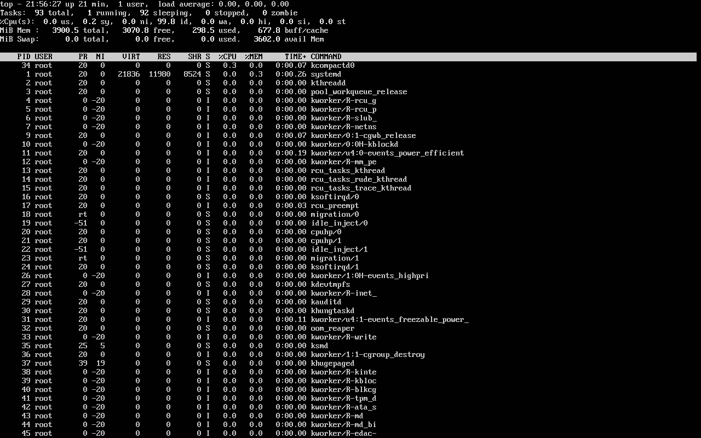 
    
    

  Первая строка oтображает: текущее время (например, 22:23:45), uptime системы (up X days, HH:MM), количество пользователей (Y users), load average за 1, 5 и 15 минут (load average: Z1, Z2, Z3).​
  Вторая строка (Tasks) показывает: общее количество процессов (total: A), running (B), sleeping (C), stopped (D), zombie (E).​
  Третья строка (Cpu(s) yказывает %us (пользовательские)), %sy (системные), %ni (nice), %id (idle), %wa (I/O wait), %hi (hardware IRQ), %si (software IRQ), %st (steal).
  
1. uptime - 41 min
2. количество авторизованных пользователей - 1 user
3. среднюю загрузку системы - load average: 0.01, 0.01, 0.00
4. общее количество процессов - 94 total
5. загрузку cpu 0.0 us, 0.2 sy, 0.0 ni, 99.8 id, 0.0 wa, 0.0 hi, 0.0 si, 0.0 st
6. загрузку памяти: 3900.5 total, 3043.3 free, 305.5 used 698.6 buff/cache
7. pid процесса занимающего больше всего памяти - PID 1, 0.3%
8. pid процесса, занимающего больше всего процессорного времени - PID 1492, 2.29 = 2 минуты

- Вывод команды htop 

    

  Для сортировки используем `fn+F6`
  
  1. отсортированному по:
     
      PID

    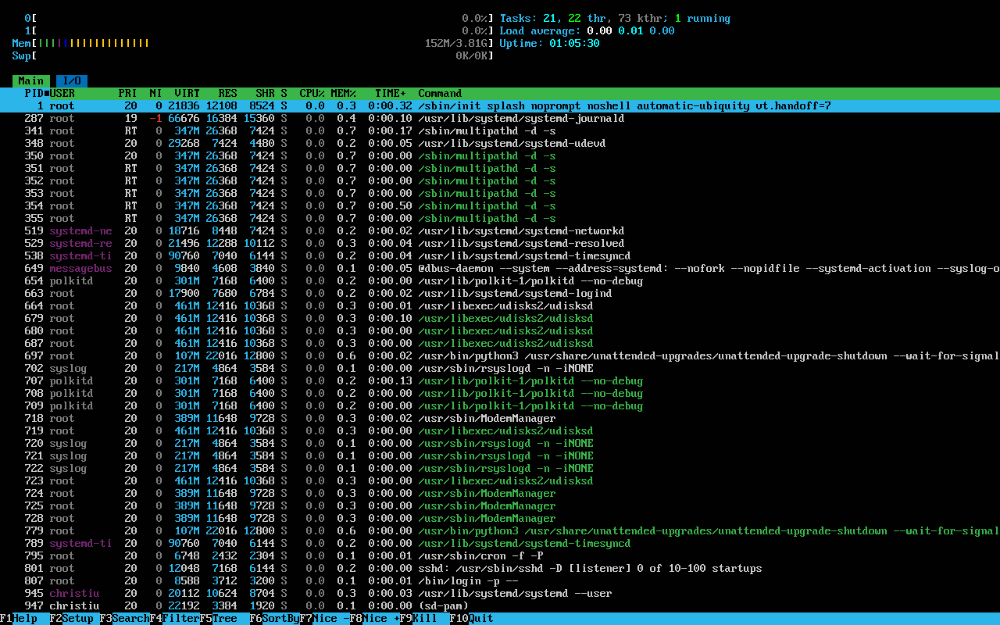

      PERCENT_CPU

    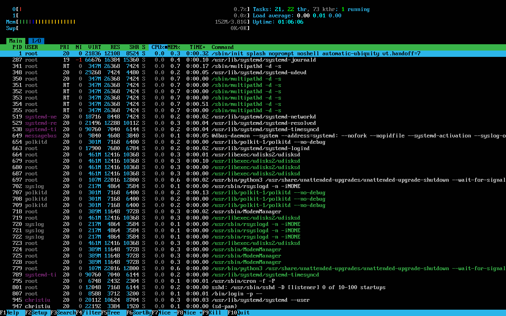

      PERCENT_MEM

    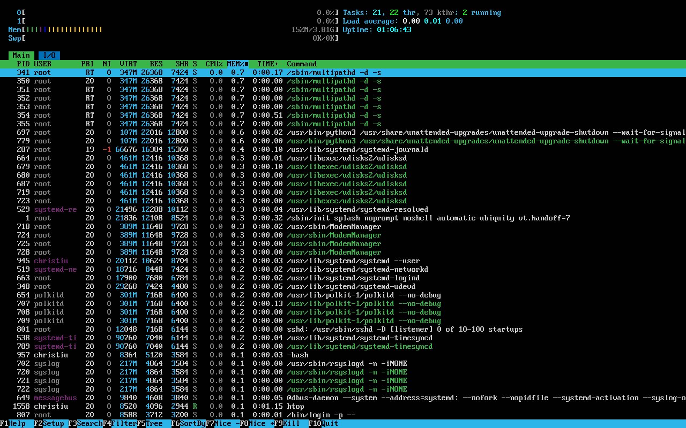

      TIME 

    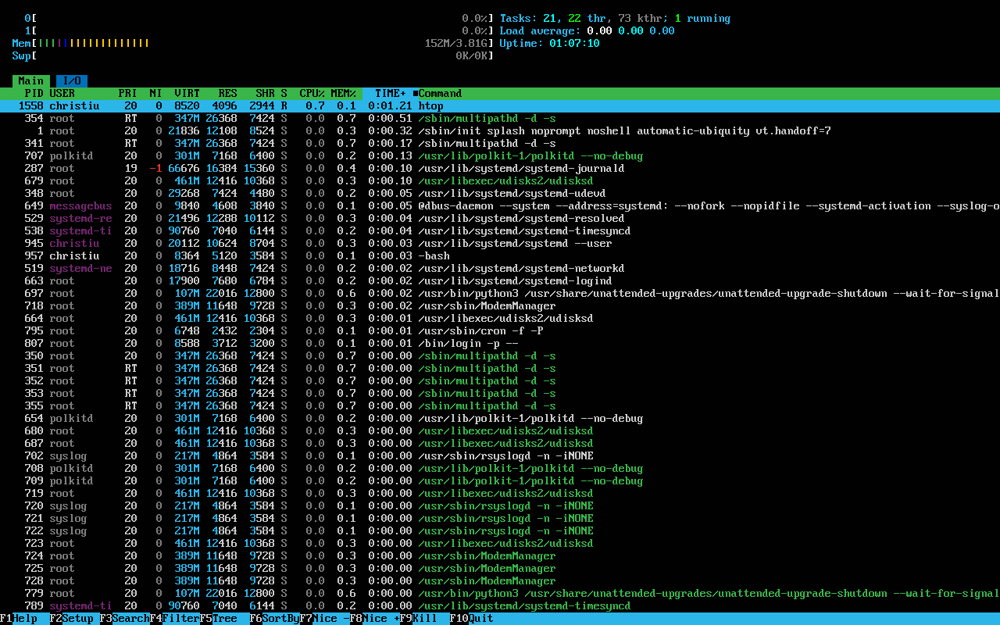

  2. отфильтрованному для процесса sshd - зажимаем `fn+F4` и вводим sshd 

    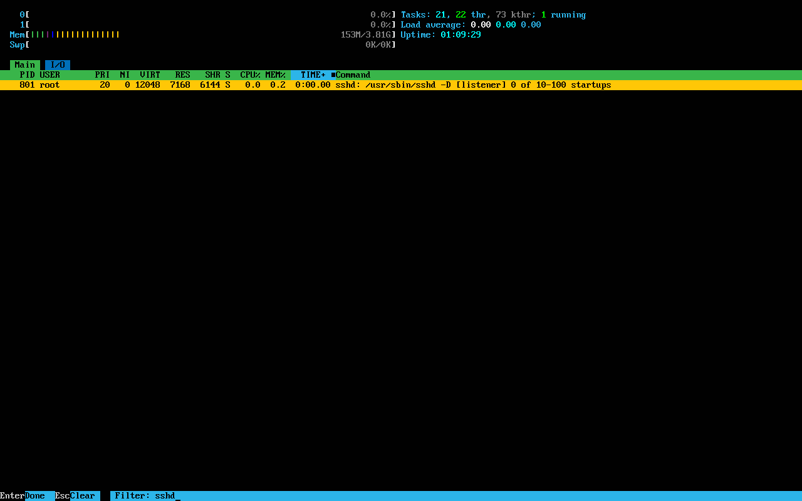

  3. - с процессом syslog, найденным, используя поиск - зажимаем `fn+F3` 
    
    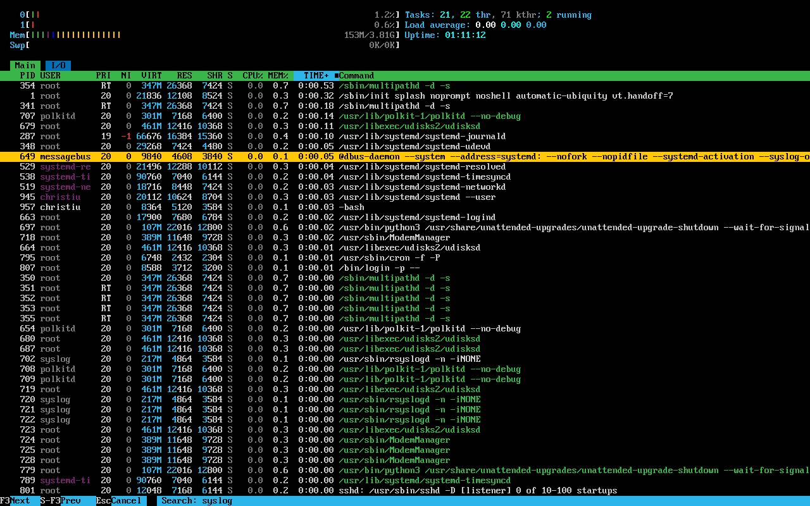

  4. с добавленным выводом hostname, clock и uptime - зажимем `fn+F2`, переходим в "Meters" → "Right column", выбираем Hostname, Uptime, Clock (добавить с помощью `enter` или переместив), подтвердить Enter. F10 (Done) для сохранения.

    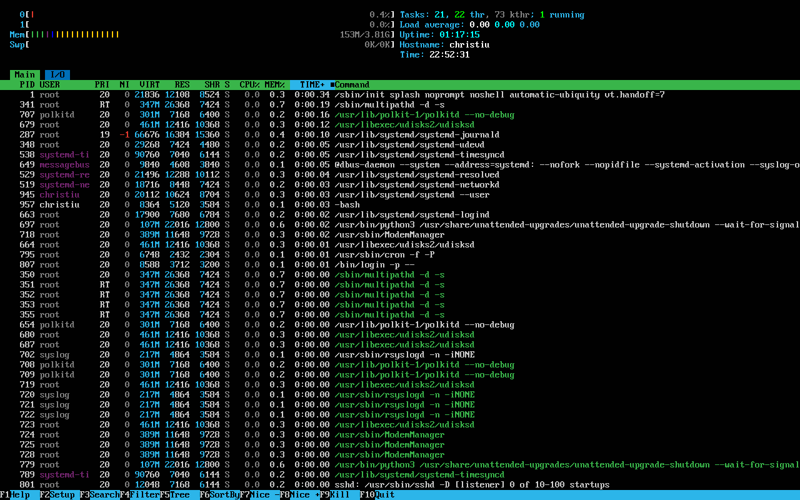

## Part 10. Использование утилиты **fdisk**

- После использования `sudo fdisk -l` 

    

  Название диска: sda1, sda2
  Размеры: sda1 - 1Gb, sda2 - 23,9Gb
  Количество секторов: sda1 - 2201600, sda2 - 50223104
  Размер SWAP получил за счет `free -h` составил 0B 

    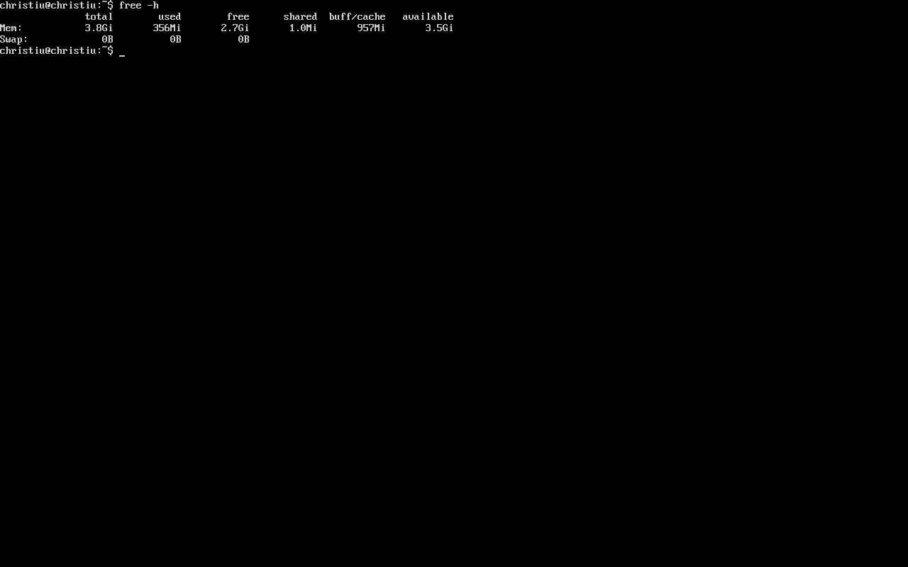

## Part 11. Использование утилиты **df**

- для корневого раздела (/):
    - размер раздела 24541264 KiB (кибибайт)
    - размер занятого пространства 2992016 KiB (кибибайт)
    - размер свободного пространства 20277288 KiB (кибибайт)
    - процент использования 13%
- Единица измерения - KiB (кибибайт) 
    
    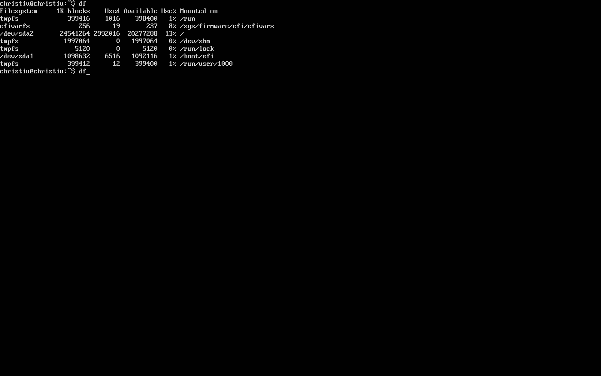

- `df -Th` - для корневого раздела (/):
    - размер раздела 23G
    - размер занятого пространства 2.9G
    - размер свободного пространства 20G
    - процент использования 13%
- тип файловой системы для раздела - ext4. Это самая распространенная и надежная файловая система для установки Ubuntu. Она предлагает хорошее сочетание производительности, стабильности и журналирования, что помогает восстановить данные в случае сбоя 

- вызов команды `df -Th`:
    
    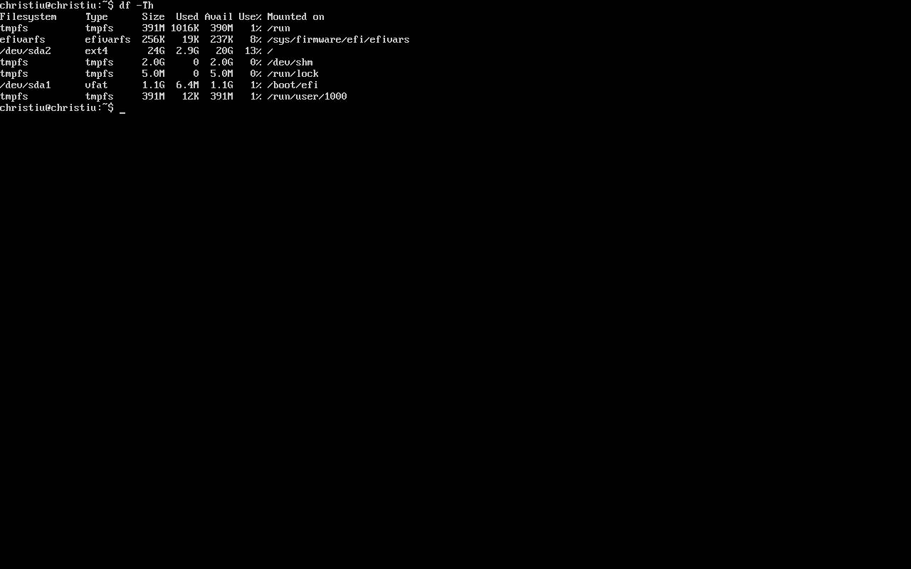

## Part 12. Использование утилиты **du**

- Вывод команды `du`: 
 

- Для вывода размера всех папок в байтах используем `sudo du -sb /home /var && sudo du -sb /var/log`, где `-s` суммирует размер папки, а `-b` 
    
    

- Вывод размера всего содержимого в /var/log (не общее, а каждого вложенного элемента, используя *)  `udo du -b /var/log/*` 
    
    

## Part 13. Установка и использование утилиты **ncdu**

- Устанавливаем `ncdu` командой `sudo apt install ncdu` 

    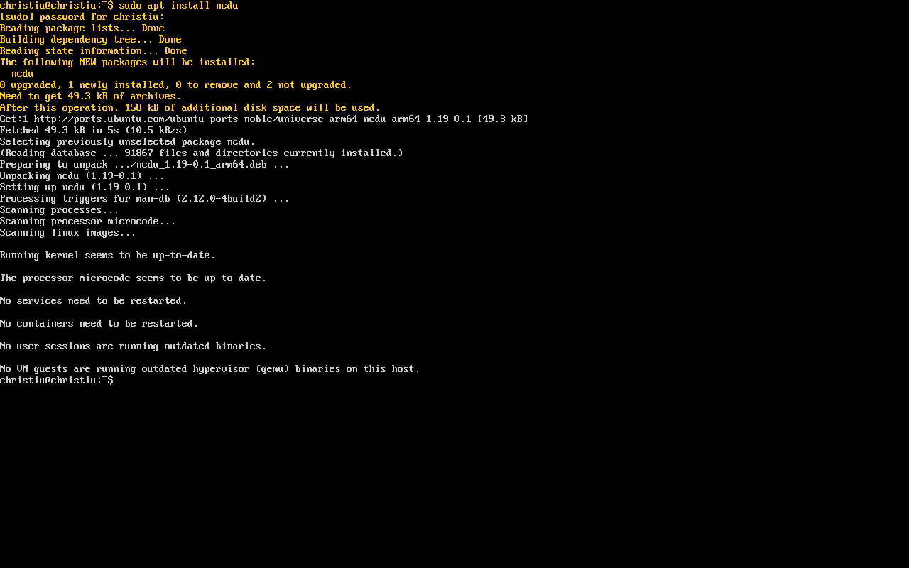

- Выводим размер папок /home, /var, /var/log командой `sudo ncdu /` - проваливаемся в каждую папку отдельно: 

  /home 

    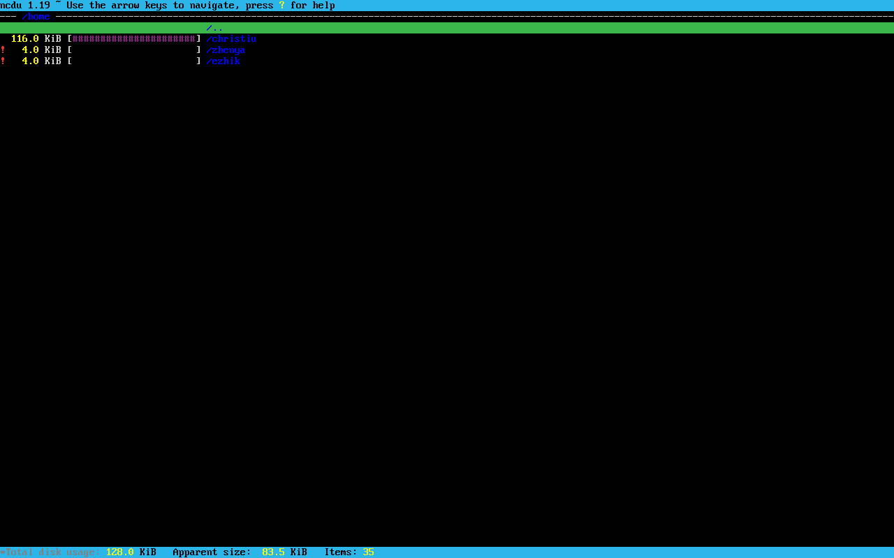

  /var 
  
    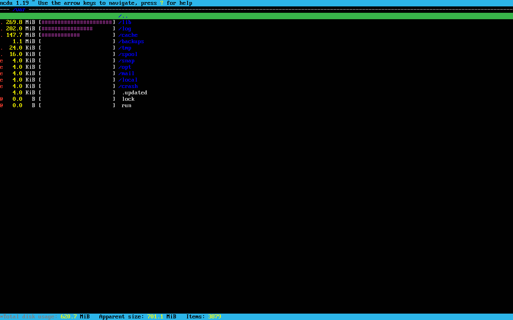

  /var/log 
    
    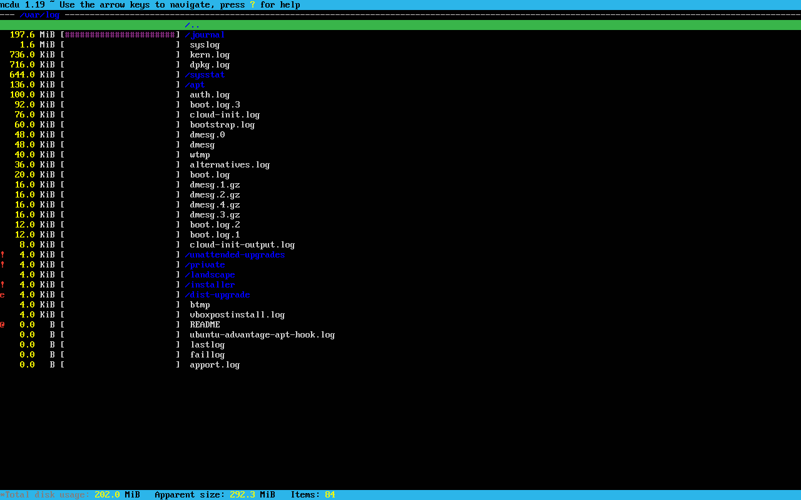

## Part 14. Работа с системными журналами

- открываю для просмотра:

1. /var/log/dmesg

2. /var/log/syslog

3. /var/log/auth.log

- Время последней успешной авторизации 21:44, имя пользователя - christiu и метод входа в систему - pam.
- Перезапуск службы SSHd `sudo systemctl restart ssh` 
- Сообщение о рестарте службы (в логах) на представленном скриншоте:

    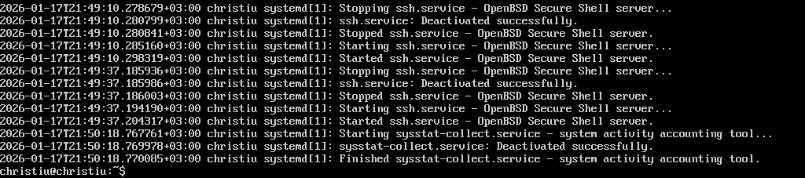

## Part 15. Использование планировщика заданий **CRON**

- Чтобы использовать `cron` в Ubuntu, вводим `crontab -e` для редактирования задач; в открывшемся редакторе добавим строки в формате: **`минута час день_месяца месяц день_недели команда`**, используя звездочки `*` для "каждый", и сохраняем файл, чтобы cron начал выполнение по расписанию.
  Строка `*/2 * * * * /usr/bin/uptime`
  - `*/2`: Запускать каждую вторую минуту.
  - `* * * *`: Для всех часов, дней месяца, месяцев, дней недели.
  - `/usr/bin/uptime`: Полный путь к команде `uptime` (на некоторых системах может быть `/bin/uptime`).

- Находим в системных журналах строчки (минимум две в заданном временном диапазоне) о выполнении. 

    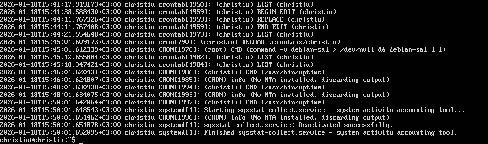

- Вывожу на экран список текущих заданий для CRON командой `crontab -l` 

    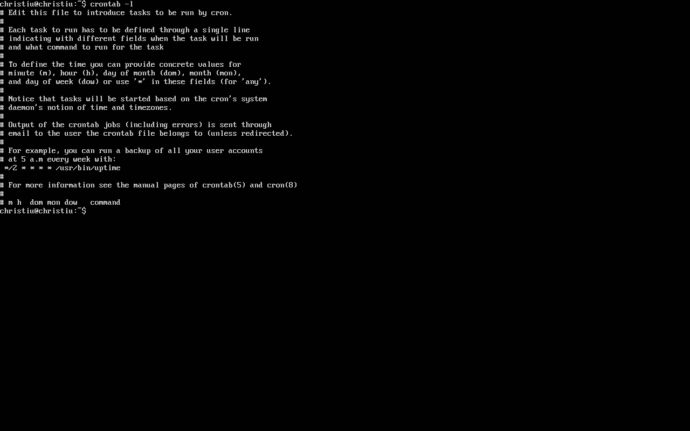

- Вставил в отчёт скрины со строчками о выполнении и списком текущих задач - скрины выше.

- Удаляю все задания из планировщика. Скриншот со списком текущих заданий для CRON 
    
    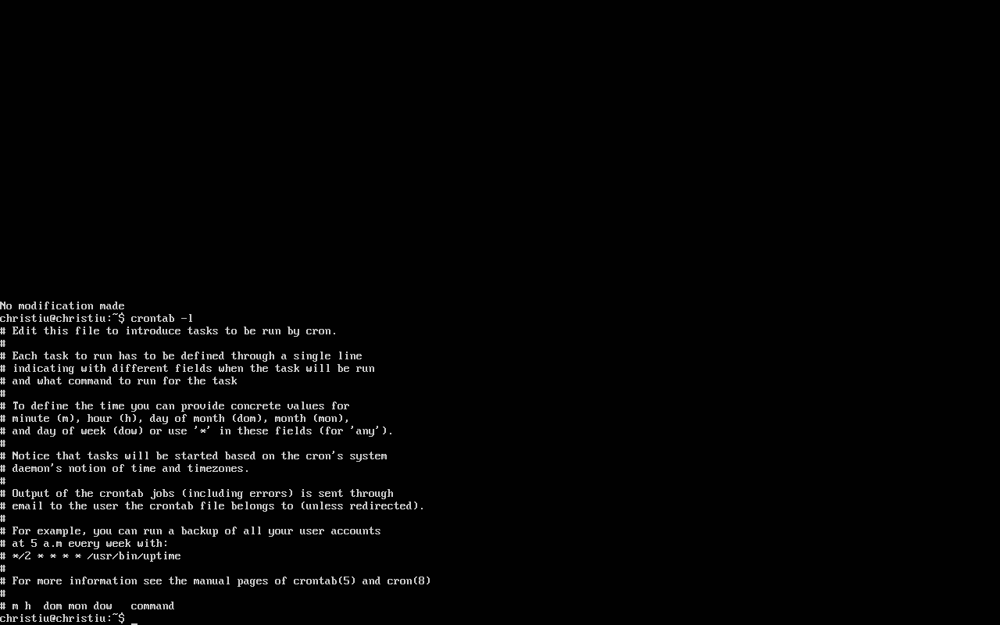